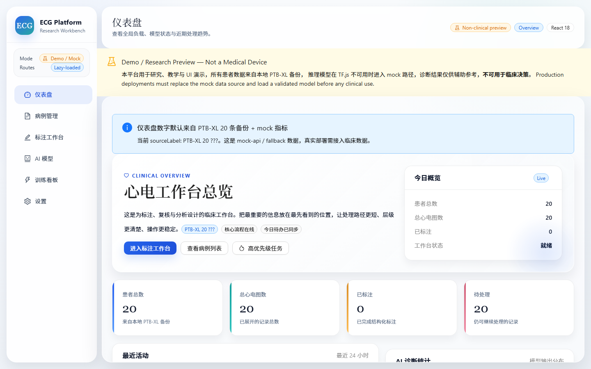
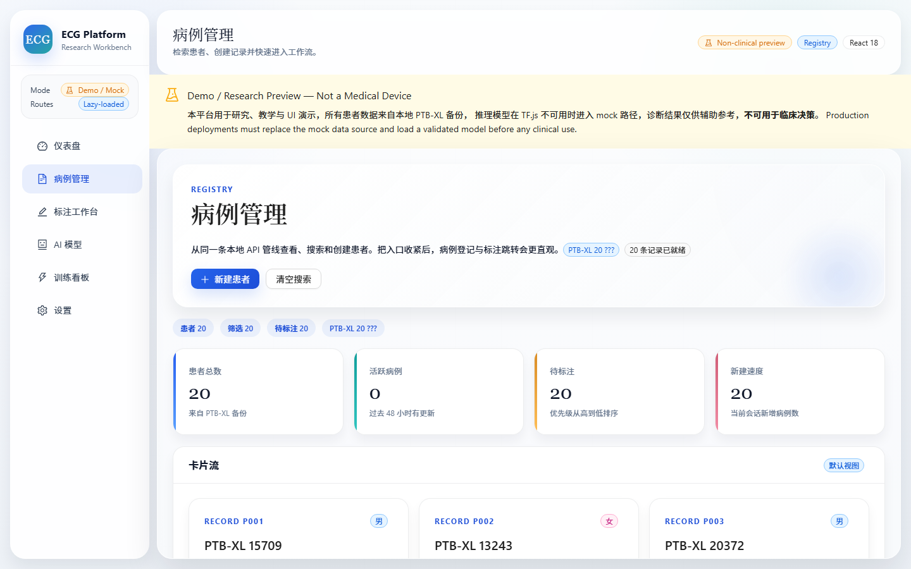
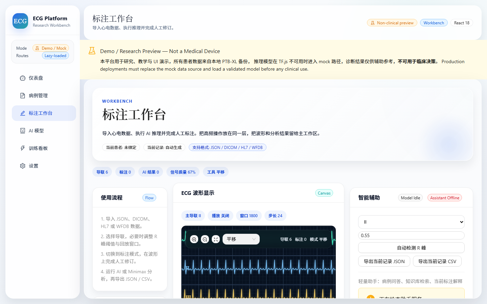
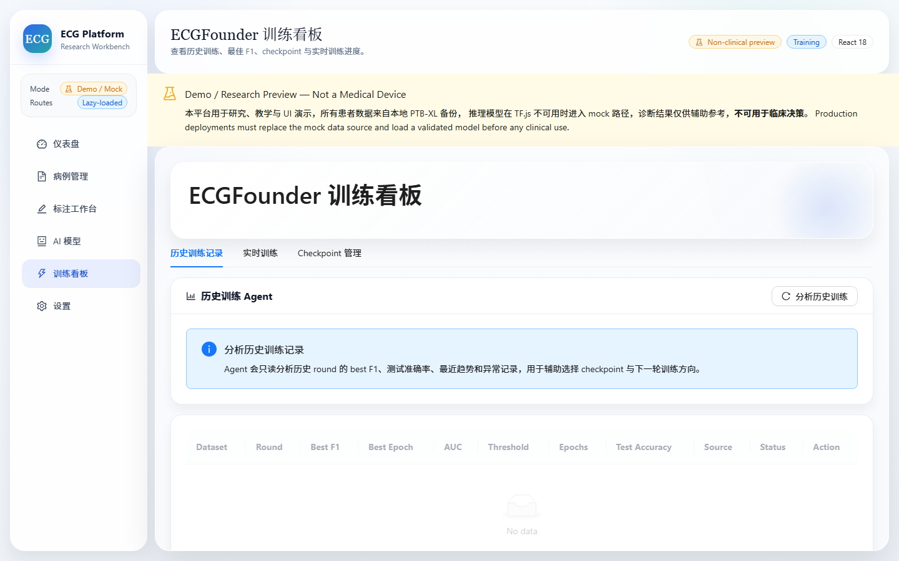
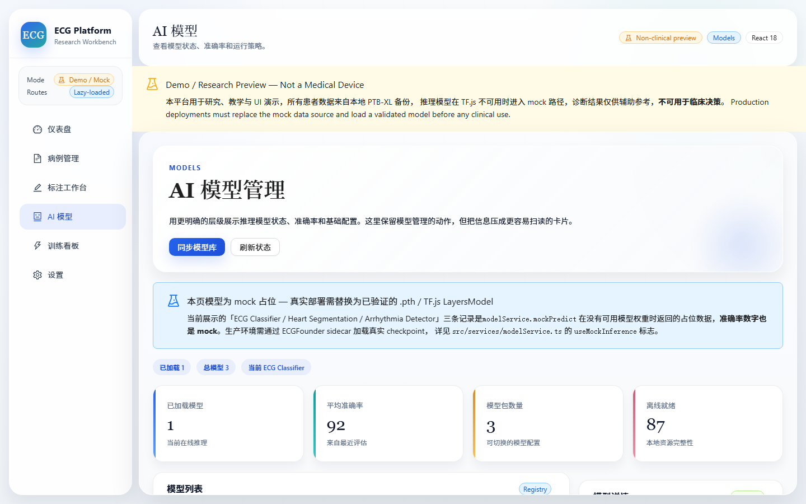

<div align="center">

# ECG Annotation & Analysis Platform

**Web-based research preview for ECG waveform annotation, AI-assisted analysis, and end-to-end training monitoring.**

[Live demo](#quick-start) · [Architecture guide](docs/superpowers/specs/2026-07-11-ecg-platform-interview-architecture-design.md) · [Demo start-up](docs/demo-startup.md) · [Changelog](CHANGELOG.md)

</div>

---

## Screenshots

The app uses a `HashRouter` SPA shell. Below are real captures of the five primary workbenches running against the local mock API + ECGFounder sidecar.

| | |
|:---:|:---:|
|  |  |
| **Dashboard** · global load & model status | **Case List** · patient registry (PTB-XL 20) |
|  |  |
| **Annotation Studio** · PQRST + AI inference + JSON/CSV export | **Training Dashboard** · MIT-BIH / CPSC2018 history + live SSE |
|  | |
| **AI Model Registry** · MOCK chips, accuracy, runtime policy | |

> Captures are produced by `scripts/shoot-screenshots.js` (Puppeteer + Edge headless). Re-run any time after `npm run dev:web` is up.

---

## What it does

- **Multi-format import** — `JSON`, `DICOM` (explicit-VR waveform tags), `HL7` (sampling/duration aware), and `WFDB` (`.hea` + `.dat` paired records with `Uint8Array` parsing); also accepts a GitHub Raw URL.
- **Full PQRST annotation on canvas** — `P`, `Q`, `R`, `S`, `T`, `ST`, `U` buttons (the full `Annotation['type']` union), Fabric.js powered, with auto R-peak detection.
- **Local AI inference** — TensorFlow.js `LayersModel` preferred, deterministic `mockPredict(...)` fallback. Exported records carry `diagnosis.source: 'real' | 'mock' | 'unavailable'` so downstream consumers can tell heuristic fallback outputs from real TF.js runs.
- **End-to-end training monitor** — REST + SSE bridge to a FastAPI sidecar that watches `ECGFounder/outputs/round_N/` and `cpsc2018_*/`, surfaces best F1 / test accuracy / checkpoint timeline.
- **Local Assistant (memory + RAG)** — TF-IDF knowledge base over `docs/` and a tiny per-session case memory; nothing leaves the machine.
- **Export** — current record → `JSON` or `CSV` with metadata + annotations + diagnosis.

---

## Quick Start

```bash
git clone https://github.com/JJ704sd/VS-vibe-coding.git
cd VS-vibe-coding
npm install
npm start            # spawns `npm run dev:api` (mock clinic API @ :4000) + `npm run dev:web` (webpack-dev-server @ :3000)
```

Open <http://localhost:3000/>. The app boots on `HashRouter`, so deep links look like `http://localhost:3000/#/annotation` and the dev server never needs to know about route paths.

For a sidecar-driven training dashboard, see [docs/demo-startup.md](docs/demo-startup.md) — it walks through `npm run preflight:demo -- --live`, the `ECGFounder` workspace, and the `finetune_runner.py` + `param_observer.py` watcher pair.

```bash
npm run build        # production bundle (CI hard-fails on bundle-budget regressions)
npm run check        # one-shot gate: lint + typecheck + unit tests + build + asset check
```

---

## Tech Stack

| Layer | Choice | Notes |
|---|---|---|
| UI | **React 18** + **TypeScript 5** | `React.lazy` per page, `ErrorBoundary` per route |
| Components | **Ant Design 5** + `@ant-design/pro-components` | Non-clinical preview banner, MOCK chips, demo-mode sidebar tag |
| Canvas | **Fabric.js 5** + custom `R-peak` detection | Ref-initialised, not bound to React state |
| State | **Redux Toolkit 2** | `ecgSlice` (workbench) + `caseSlice` (registry); `inferenceResults` excluded from serializableCheck (TF tensors) |
| AI | **TensorFlow.js 4** | `LayersModel` preferred, `mockPredict` fallback, 3-state outcome (`real` / `mock` / `unavailable`) |
| Charts | **ECharts 5** + **d3 7** | Dashboard + training charts; lazy chunk |
| Bundler | **Webpack 5** + `ts-loader` (transpileOnly) | Dev / prod split, bundle budget enforced in prod (`hints: 'error'`) |
| Backend | **Python FastAPI** sidecar | `proxy-server/`, `localhost:6090`, ECGFounder file watcher + SSE |
| Local mock | **Node mock API** (port 4000) | `mock-api/server.js`, PTB-XL 20 backup fallback when network fails |
| Tests | **Node test runner** + **pytest** | No Jest; ~30 frontend test files, 9 backend pytest files |

---

## Project Structure

```
.
├── src/
│   ├── pages/              # Dashboard / CaseList / CaseDetail / AnnotationStudio / AIModels / TrainingDashboard / Settings
│   ├── components/         # Layout, DemoBanner, ErrorBoundary, Annotation canvas, etc.
│   ├── services/           # parser (JSON/DICOM/HL7/WFDB), modelService, firebaseService, clinicApi, trainingApi, ecgAssistantApi
│   ├── store/              # Redux Toolkit slices (ecg, case, training, assistant)
│   ├── hooks/              # useOfflineMode, useFirebase, useInference, useTFLite
│   ├── utils/              # signal processing, export, buildDiagnosis, format
│   ├── types/              # domain types
│   └── config/env.ts       # single source of truth for env vars
├── proxy-server/           # Python FastAPI sidecar + ECGFounder bridge + Assistant (memory + RAG)
│   ├── main.py             # app entry (uvicorn, CORS allow-list, admin token)
│   ├── training/           # finetune_runner, param_observer, parsers
│   ├── assistant/          # text_index, memory_store, rag_store, service
│   └── tests/              # pytest
├── mock-api/               # Node Express server backing the clinic dashboard
├── docs/
│   ├── screenshots/        # README cover captures
│   ├── audits/             # bug audit closeout
│   ├── superpowers/        # specs + plans
│   └── demo-startup.md
├── shotter-tmp/            # puppeteer screenshot helper
├── templates/app.html      # Webpack HtmlWebpackPlugin template
├── webpack.config.js       # prod (hints: 'error', CI gate)
├── webpack.config.dev.js   # dev (hints: false to suppress noisy overlay)
└── package.json
```

---

## Tests

```bash
npm run test:unit         # frontend — Node built-in test runner, ~30 test files
npm run test:backend      # proxy-server pytest (proxied via npm script)
npm run check             # one-shot gate: lint + typecheck + unit tests + prod build + asset check
npm run preflight:demo -- --live   # end-to-end demo check (sidecar + runner + observer)
```

The frontend uses Node's built-in test runner (no Jest) with `happy-dom` for component tests. Backend uses `pytest` with the FastAPI app mounted in-process.

---

## Demo / Non-clinical boundary

This project is a **research preview**, not a medical device.

- **Patient data** is sourced from a 20-record PTB-XL backup embedded in `src/data/mockClinic.ts`. Real deployments must swap this for a clinical data source behind the same `clinicApi.ts` interface.
- **AI inference** in `modelService.ts` falls back to `mockPredict(...)` when no TF.js `LayersModel` is loaded. The accuracy numbers on the **AI Models** page are mock unless a real `.pth` / TF.js bundle replaces `/models/ecg-classifier/model.json`. Exported JSON / CSV carry `diagnosis.source: 'real' | 'mock' | 'unavailable'` (see `src/utils/buildDiagnosis.ts`).
- **Sidecar** (`proxy-server/main.py`) is bound to `localhost` and reads from the local `D:/ECG founder/ECGFounder` training workspace by default; the path is overridable via `ECGFOUNDER_BASE`. Destructive routes require an admin token; the env var is required and fail-closed.
- **Assistant** (memory + RAG) writes to `proxy-server/assistant_memory.json`; nothing leaves the machine.
- **CORS** for the sidecar is restricted to local dev origins by default (`SIDECAR_ALLOW_ORIGINS` env var).

In the UI every page surfaces a yellow **Non-clinical preview** banner (`src/components/DemoBanner.tsx`), the sidebar carries a `Demo / Mock` mode tag, the **AI Models** page marks each entry with an orange `MOCK` chip, and the **Annotation Studio** AI results card renders a persistent `MOCK` chip whenever `modelService.isUsingMockInference()` is true.

---

## Highlights for review

- **Risk-driven test closeout** — see `docs/audits/2026-07-07-FINAL-REPORT.md` (4 tracks, 18 P0/P1 fixes, 246 tests).
- **Architecture & interview prep** — `docs/superpowers/specs/2026-07-11-ecg-platform-interview-architecture-design.md` walks the front-end data flow, sidecar contract, parser & model boundaries, and the lazy-loaded chunk graph.
- **Bundle budget** — `webpack.config.js` hard-fails CI when an entrypoint crosses `1.6 MiB` or any chunk crosses `1.5 MiB` (`hints: 'error'`, `assetFilter` covers async chunks). `webpack.config.dev.js` switches to `hints: false` so the dev overlay doesn't pop on every TensorFlow.js recompile.

---

## License

MIT — see `LICENSE` if present. Otherwise the default `package.json` license applies.

<div align="center">

<sub>Built with React 18 · TypeScript 5 · TensorFlow.js 4 · Ant Design 5 · Fabric.js 5 · FastAPI · Webpack 5</sub>

</div>
