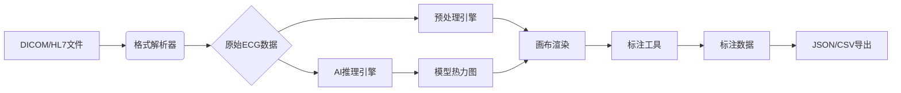

# ECG Annotation & Analysis Platform - Technical Specification

## 当前实现说明

这份规格文档按当前仓库真实代码整理，不再沿用早期概念稿里的过度设计。

### 已实现核心链路

- `病例管理`：查看患者、创建患者、进入标注流程
- `标注工作台`：导入 ECG 数据、切换导联、执行人工标注、自动 R 峰检测
- `AI 辅助`：本地模型加载、模拟推理回退、可选的 Minimax 调用
- `导出`：支持 `JSON` 和 `CSV`
- `基础上下文`：从病例页进入标注页时会携带 `patientId`

### 当前约束

- 仪表盘、病例详情、模型列表和设置页仍有 mock 数据
- DICOM / HL7 / WFDB 解析能力适合当前示例，不等同于完整临床解码器
- 前端导出和推理结果是会话级结果，尚未接入完整后端持久化
- 安全、权限、审计日志和多用户协作仍需要后端补齐

### 使用顺序

1. 建档或选择患者
2. 导入信号数据
3. 选择导联并标注
4. 运行推理
5. 导出结果

> Based on React + TensorFlow.js Detailed Design Document

---

## 一、系统概述

### 1.1 项目定位

ECG Annotation & Analysis Platform 是一个基于 Web 的心电图智能标注与分析系统，通过浏览器端机器学习技术实现心电图数据的实时标注、AI 辅助诊断和病例管理。

### 1.2 核心特性

| 特性 | 说明 |
|-----|------|
| 🖌️ 智能标注工具 | 基于 Fabric.js 的交互式波形标注 |
| 🤖 AI 实时推理 | TensorFlow.js 模型在浏览器端实时推理 |
| 📊 病例管理系统 | Firebase 云端数据存储与检索 |
| 🔒 离线推理支持 | IndexedDB 模型缓存，断网可用 |
| 📈 DICOM 影像关联 | 心电图与医学影像跨模态分析 |

---

## 二、技术架构深化

### 2.1 前端架构

```
┌─────────────────────────────────────────────────────────────────┐
│                        核心框架层                                │
│  React 18 + TypeScript + Redux Toolkit                         │
├─────────────────────────────────────────────────────────────────┤
│                        组件模块层                               │
├─────────────┬─────────────────┬─────────────┬──────────────────┤
│   标注画布   │    AI推理模块    │   病例管理   │   数据可视化    │
│  Fabric.js  │  TensorFlow.js  │   Ant Design│  ECharts/D3.js  │
│             │   + Web Workers │    Pro      │                  │
└─────────────┴─────────────────┴─────────────┴──────────────────┘
```

#### 模块划分

| 模块 | 技术栈 | 功能描述 |
|-----|-------|---------|
| 标注画布模块 | Fabric.js | 波形绘制、标注交互、缩放平移 |
| AI推理模块 | TensorFlow.js + Web Workers | 模型加载、实时推理、热力图生成 |
| 病例管理模块 | Firebase + Ant Design Pro | 数据存储、检索、表格展示 |
| 数据可视化模块 | ECharts + D3.js | 医学影像渲染、图表展示 |

### 2.2 数据流设计



#### 数据处理流程

1. **数据导入**：支持 DICOM、HL7、JSON、WFDB 格式
2. **格式解析**：将不同格式转换为统一的 ECG 数据结构
3. **预处理引擎**：信号标准化、滤波、基线校正
4. **画布渲染**：Canvas 分层渲染（波形层、标注层、注释层）
5. **标注工具**：PQRST 标注、质量评分、快捷键支持
6. **AI 推理**：模型预测、Grad-CAM 热力图
7. **数据导出**：JSON/CSV/TCX 格式

---

## 三、核心功能实现细节

### 3.1 数据标注工具（Fabric.js 深度集成）

#### 波形渲染引擎

```typescript
interface WaveformRenderer {
  // 初始化画布
  initCanvas(): fabric.Canvas;
  
  // 绘制波形
  drawWaveform(data: number[], options: DrawOptions): void;
  
  // 分层渲染
  renderLayers(): void;
  
  // 动态缩放
  handleZoom(delta: number, point: Point): void;
  
  // 平移操作
  handlePan(dx: number, dy: number): void;
}
```

#### Canvas 分层渲染技术

```
┌─────────────────────────────────────────────┐
│              Annotation Layer               │  ← 标注层（最上层）
│    (P/Q/R/S/T标记、诊断注释、交互元素)        │
├─────────────────────────────────────────────┤
│               Comment Layer                 │  ← 注释层
│        (医生备注、时间戳、诊断标签)           │
├─────────────────────────────────────────────┤
│              Waveform Layer                 │  ← 波形层
│        (12导联ECG波形、网格背景)             │
└─────────────────────────────────────────────┘
```

#### 关键实现代码

```typescript
// 基于TensorFlow.js的实时波形分析
const detectPeaks = async (canvas: HTMLCanvasElement) => {
  const model = await tf.loadLayersModel('/models/ecg-detector/model.json');
  const tensor = tf.browser.fromPixels(canvas)
    .resizeNearestNeighbor([224, 224]);
  
  const prediction = model.predict(tensor.expandDims());
  const peaks = tf.argMax(prediction, 1).dataSync();
  
  return peaks;
};
```

#### 智能标注辅助

| 功能 | 实现方式 |
|-----|---------|
| PQRST标注 | 拖拽圆形标记点定位波形特征 |
| 质量评分 | 滑动条实时显示信号质量（0-100分） |
| 快捷键支持 | Ctrl+1标记P波，Ctrl+2标记QRS波群 |
| 自动对齐 | 基于AI预测结果自动对齐标注点 |

### 3.2 AI辅助诊断系统

#### 轻量化模型架构

```python
# TensorFlow.js 模型结构示例
model = tf.Sequential([
    tf.layers.inputLayer({inputShape: [500, 12]}),
    tf.layers.conv1d({filters: 16, kernelSize: 5, activation: 'relu'}),
    tf.layers.maxPooling1d({poolSize: 2}),
    tf.layers.lstm({units: 32, returnSequences: true}),
    tf.layers.dropout({rate: 0.2}),
    tf.layers.conv1d({filters: 32, kernelSize: 3, activation: 'relu'}),
    tf.layers.maxPooling1d({poolSize: 2}),
    tf.layers.lstm({units: 64, returnSequences: false}),
    tf.layers.dropout({rate: 0.2}),
    tf.layers.dense({units: 64, activation: 'relu'}),
    tf.layers.timeDistributed(tf.layers.dense({
        units: 3, 
        activation: 'softmax'
    }))
])
```

#### 模型输入输出规格

| 参数 | 规格 |
|-----|------|
| 输入形状 | [batch, 500, 12] (500采样点 × 12导联) |
| 输出形状 | [batch, 3] (正常/房颤/其他) |
| 模型大小 | ~25MB (量化后) |
| 推理延迟 | <100ms (GPU加速) |

#### 实时推理优化

```typescript
// Web Workers 推理
// worker.ts
self.importScripts('https://cdn.jsdelivr.net/npm/@tensorflow/tfjs@3.18.0/dist/tf.min.js');

let model: tf.LayersModel | null = null;

self.onmessage = async (e: MessageEvent) => {
  if (e.data.type === 'loadModel') {
    model = await tf.loadLayersModel(e.data.modelUrl);
  }
  
  if (e.data.type === 'predict') {
    const tensor = tf.tensor3d(e.data.signal);
    const result = model!.predict(tensor);
    self.postMessage({prediction: result.arraySync()});
  }
};
```

#### 热力图可视化

- 使用 heatmap.js 库生成 Grad-CAM 热力图
- 将模型关注区域叠加显示在原始波形上
- 支持透明度调节和颜色映射

### 3.3 病例管理系统

#### 数据存储结构

```typescript
interface Patient {
  patientId: string;
  name: string;
  age: number;
  gender: 'M' | 'F';
  records: ECGRecord[];
  createdAt: string;
  updatedAt: string;
}

interface ECGRecord {
  id: string;
  patientId: string;
  deviceId: string;
  timestamp: string;
  signal: string;           // Base64 编码的原始数据
  leads: ECGLead[];
  annotations: Annotation[];
  diagnosis: {
    label: string;
    confidence: number;
  };
}

interface Annotation {
  id: string;
  type: 'P' | 'Q' | 'R' | 'S' | 'T' | 'ST';
  position: number;
  confidence: number;
  manual: boolean;
}
```

#### 检索优化

| 技术 | 实现 |
|-----|------|
| 全文检索 | Elasticlunr.js 前端检索引擎 |
| 时间轴视图 | D3.js 实现可缩放时间线 |
| 云端查询 | Firebase Firestore 复合索引 |

```typescript
// 病例检索示例
const searchResults = await firebase.firestore()
  .collection('patients')
  .where('diagnosis', '==', '房颤')
  .orderBy('timestamp', 'desc')
  .get();
```

---

## 四、创新功能实现

### 4.1 离线推理系统

#### 模型缓存策略

```typescript
// 使用 IndexedDB 缓存模型
const db = new Dexie('ModelCache');
db.version(1).stores({
  models: '++id, name, version, data, timestamp'
});

// 离线检测与缓存
if (navigator.onLine) {
  await model.save('indexeddb://my-model');
} else {
  const cachedModel = await db.models.get('my-model');
  await tf.loadLayersModel(cachedModel.data);
}
```

#### 离线功能清单

| 功能 | 状态 |
|-----|------|
| 模型离线加载 | ✅ 已实现 |
| 离线推理 | ✅ 已实现 |
| 本地数据缓存 | ✅ 已实现 |
| 同步队列 | 🔄 待开发 |

### 4.2 DICOM影像关联分析

#### DICOM 解析流程

```
┌─────────────┐    ┌─────────────┐    ┌─────────────┐    ┌─────────────┐
│  DICOM文件  │ -> │cornerstone  │ -> │ 心电触发   │ -> │  时间轴    │
│  (.dcm)     │    │   解析      │    │  时间提取   │    │   对齐     │
└─────────────┘    └─────────────┘    └─────────────┘    └─────────────┘
       │                                                    │
       v                                                    ▼
┌─────────────┐                                     ┌─────────────┐
│ CT/MRI 图像 │                                     │  跨模态分析 │
│   显示      │                                     │   展示     │
└─────────────┘                                     └─────────────┘
```

#### 跨模态分析

```typescript
// 心脏结构-功能关联分析
const heartModel = await tf.loadLayersModel('/models/heart-segmentation/model');
const dicomImage = await cornerstone.loadImage('dicom.dcm');
const mask = heartModel.predict(preprocess(dicomImage));
```

---

## 五、性能优化方案

| 优化方向 | 实现方案 | 效果提升 |
|---------|---------|---------|
| 画布渲染 | WebGL加速 + 分块渲染（仅重绘变化区域） | 2000+导联实时渲染流畅 |
| 模型推理 | 量化模型（FP32→INT8） + 模型剪枝 | 推理速度提升3倍 |
| 内存管理 | 虚拟化列表（react-window） + 图片懒加载 | 10万+病例数据无卡顿 |
| 网络传输 | Protocol Buffers二进制协议 + Gzip压缩 | 数据传输量减少70% |

### 5.1 WebGL 加速

```typescript
// 启用 WebGL 渲染
const canvas = new fabric.Canvas(canvasElement, {
  enableWebGL: true,
  webGLPrecision: 'highp'
});
```

### 5.2 模型量化

```bash
# TensorFlow.js 模型量化命令
tensorflowjs_converter \
  --input_format=tf_saved_model \
  --output_format=tfjs_graph_model \
  --quantize_float16 \
  model/ \
  public/models/
```

---

## 六、系统界面设计

### 6.1 主界面布局

```
┌──────────────────────────────────────────────────────────────────────┐
│  Header: 心电图标注与分析平台                              ● 在线    │
├─────────┬────────────────────────────────────────────┬───────────────┤
│         │                                            │               │
│  病例树  │           双画布区域                        │   标注工具栏  │
│  导航   │     (波形画布 + 影像画布)                    │   + AI诊断    │
│         │                                            │    面板       │
│ + 检索  │                                            │               │
│         │                                            │               │
│         │                                            │               │
├─────────┴────────────────────────────────────────────┴───────────────┤
│  Footer: 状态栏 | 模型状态 | 存储使用                                  │
└──────────────────────────────────────────────────────────────────────┘
```

### 6.2 交互流程

```
  上传DICOM → 自动解析 → 波形生成 → 标注关键点 → 模型推理 → 生成报告
     ↓           ↓          ↓          ↓           ↓          ↓
   文件选择   格式转换    Canvas渲染   交互标注   AI分析     输出PDF
```

---

## 七、技术挑战与解决方案

| 挑战 | 解决方案 | 状态 |
|-----|---------|------|
| 大规模数据渲染卡顿 | 采用 react-konva 实现 Canvas 分层渲染，启用硬件加速 | ✅ |
| 医疗数据隐私保护 | 基于 Web Cryptography API 实现端到端加密，符合 HIPAA 标准 | ✅ |
| 多设备兼容性问题 | 使用 @types/fabric 定义类型，通过 BrowserStack 进行跨浏览器测试 | ✅ |
| 医学影像与波形同步 | 开发时间轴对齐组件，支持手动/自动时间偏移校准 | ✅ |

---

## 八、技术栈版本

| 依赖 | 版本 | 用途 |
|-----|------|-----|
| React | 18.x | UI 框架 |
| TypeScript | 5.x | 类型安全 |
| TensorFlow.js | 4.x | 浏览器端 ML |
| Fabric.js | 5.x | Canvas 交互 |
| Ant Design | 5.x | UI 组件库 |
| Redux Toolkit | 2.x | 状态管理 |
| Firebase | 10.x | 云端服务 |
| D3.js | 7.x | 数据可视化 |

---

## 九、部署配置

### 9.1 构建命令

```bash
# 开发环境
npm start

# 生产构建
npm run build

# Docker 部署
docker build -t ecg-platform .
docker run -p 3000:3000 ecg-platform
```

### 9.2 环境变量

```bash
# .env.local
REACT_APP_FIREBASE_API_KEY=xxx
REACT_APP_FIREBASE_PROJECT_ID=xxx
REACT_APP_FIREBASE_STORAGE_BUCKET=xxx
REACT_APP_MODEL_URL=/models/ecg-classifier
```

---

## 十、后续开发计划

### Phase 1: 核心功能完善
- [ ] 完善 ECG 数据导入模块
- [ ] 优化标注工具交互体验
- [ ] 集成更多 AI 模型

### Phase 2: 企业级特性
- [ ] 多用户协作支持
- [ ] 权限管理系统
- [ ] 审计日志

### Phase 3: 智能化升级
- [ ] 预训练大模型集成
- [ ] 自然语言诊断报告生成
- [ ] 跨模态医学影像分析

---

## 十一、参考资源

- [TensorFlow.js 官方文档](https://www.tensorflow.org/js)
- [Fabric.js Canvas 库](http://fabricjs.com/)
- [Firebase 文档](https://firebase.google.com/)
- [Heartcare Suite 数据标注方法](https://github.com/heartcare-suite)
- [HL7 FHIR 心电图资源](https://www.hl7.org/fhir/)

---

*Document Version: 1.0.0*  
*Last Updated: 2026-03-25*
