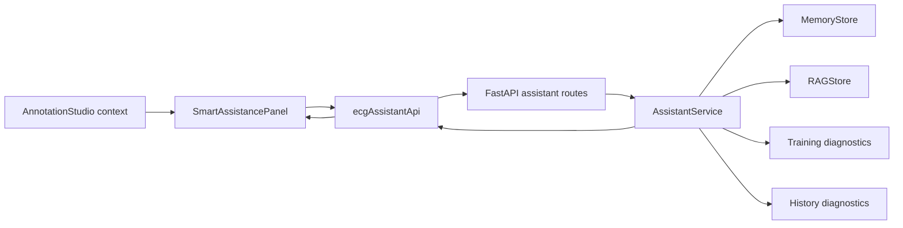

# Unified Agent Center Design

Date: 2026-05-16

## Goal

Expand the existing ECG assistant into a unified Agent Center that can explain the current annotation case, retrieve project knowledge, summarize training health, and analyze historical training results from one consistent interface.

The first version is read-only. It gives summaries, warnings, citations, and suggested next steps. It does not modify annotations, run inference, start or stop training, delete history, or change model files.

## Current Context

The project already has three partial agent surfaces:

- `SmartAssistancePanel` in the annotation studio handles case questions, knowledge search, and case memory through `ecgAssistantApi`.
- `TrainingAgentPanel` presents current training diagnostics through `trainingApi`.
- `HistoryTrainingAgentPanel` presents historical round analysis through `trainingApi`.

The sidecar already has the right foundation:

- `AssistantService` combines case memory and RAG knowledge search.
- `MemoryStore` persists case snapshots.
- `RAGStore` indexes README, SPEC, and docs markdown.
- `training_diagnostics.py` builds current and historical training recommendations.
- `main.py` exposes assistant and training diagnostic endpoints.

The gap is orchestration. Users must move between separate panels and ask narrow questions. The system does not yet return a single agent-oriented view with combined context, intent, warnings, and recommendations.

## Recommended Approach

Use a backend-orchestrated Agent Center.

The frontend should stay compact and mostly present structured data. The sidecar should own the agent decision logic because it already has access to memory search, knowledge search, training state, parameter stats, and history parsers. This keeps business rules out of React components and makes the behavior easier to test.

## User Experience

The Agent Center appears inside the existing intelligent assistance area rather than as a new top-level route in the first version. This keeps the change close to annotation and training workflows and avoids adding page-level navigation before the workflow proves useful.

The panel has four sections:

1. Agent overview
   - Current case summary: patient, record, primary lead, lead count, signal quality, annotation count, annotation distribution, manual versus automatic annotations, and top AI results.
   - Training summary: current training status, severity, and most important recommendation.
   - History summary: best round, recent trend, anomaly count, and recommended checkpoint direction.

2. Ask Agent
   - A single input supports case, knowledge, memory, training, history, and mixed questions.
   - Quick prompts cover common workflows: explain current case, inspect missing annotation risk, summarize training health, pick best checkpoint, and explain WFDB import.

3. Recommendations
   - Returned recommendations are displayed as plain suggested actions.
   - The UI labels them as read-only suggestions. No recommendation has an automatic execution button in version one.

4. Evidence
   - Sources include current case context, case memory, knowledge chunks, training state, and history rounds.
   - Every answer that uses retrieved or computed context exposes its source list.

If the sidecar is offline, the panel still shows a local current-case snapshot built in the browser and explains that knowledge, memory, and training diagnostics require the sidecar.

## Backend Design

Add a unified assistant summary endpoint:

`POST /api/assistant/summary`

Request body:

```json
{
  "context": {
    "patientId": "string",
    "recordId": "string",
    "leadCount": 12,
    "primaryLead": "II",
    "annotationCount": 23,
    "signalQuality": 86,
    "annotations": [],
    "aiResults": []
  }
}
```

Response body:

```json
{
  "caseSummary": {
    "title": "string",
    "items": [],
    "warnings": []
  },
  "trainingSummary": {
    "available": true,
    "severity": "info",
    "summary": "string",
    "recommendations": []
  },
  "historySummary": {
    "available": true,
    "severity": "info",
    "summary": "string",
    "recommendations": []
  },
  "recommendations": [],
  "warnings": [],
  "sources": []
}
```

Extend `POST /api/assistant/ask` so responses can include:

- `mode`: `case`, `memory`, `knowledge`, `training`, `history`, or `mixed`
- `answer`: readable answer text
- `sources`: current source list
- `recommendations`: suggested actions
- `warnings`: safety and data quality notes

Intent detection should remain deterministic for this version. Use keyword groups and available context rather than adding an LLM dependency. Training and history questions should call existing diagnostic builders. Mixed questions can combine case summary with the most relevant diagnostic or knowledge source.

Backend safety rules:

- Never mutate annotations or training state from assistant endpoints.
- Never expose filesystem paths beyond existing source labels and safe repo-relative paths.
- Treat clinical content as workflow support, not a diagnosis.
- Return graceful fallback summaries when training files or history outputs are missing.

## Frontend Design

Extend `src/services/ecgAssistantApi.ts` with:

- `AssistantMode`
- `AssistantRecommendation`
- `AssistantWarning`
- `AssistantSummary`
- `getAssistantSummary(context)`
- extended `AssistantAnswer` fields for recommendations and warnings

Refactor `SmartAssistancePanel` in place:

- Keep existing model status, assistant health, lead selection, threshold input, R peak detection, export, memory recording, and knowledge rebuild controls.
- Add a "Generate Agent Overview" action.
- Render case, training, and history summary blocks when summary data is available.
- Render recommendations and warnings under both overview and ask results.
- Keep quick questions but update them to target unified intents.

Do not add a new Redux slice in this version. The panel state is local UI state, and the context already comes from `AnnotationStudio`.

## Data Flow



## Error Handling

Frontend:

- Health check failure disables remote agent actions but keeps local case summary visible.
- Summary and ask errors use Ant Design messages and preserve the last successful result.
- Empty recommendations and sources use explicit empty states.

Backend:

- Empty question returns HTTP 400.
- Missing training state or history files returns available false for that summary section, not a hard failure for the whole summary.
- Malformed optional context fields are ignored or normalized.

## Testing

Python tests:

- Summary endpoint combines case context, training diagnosis, and history diagnosis.
- Training intent routes to training diagnostics.
- History intent routes to history diagnostics.
- Missing training/history data returns a graceful fallback.
- Existing memory and RAG behavior remains unchanged.

TypeScript tests:

- `getAssistantSummary` calls the expected endpoint and returns typed data.
- Extended `askECGAssistant` preserves compatibility with existing responses that do not include recommendations or warnings.

Manual verification:

- Start the app and sidecar.
- Open Annotation Studio.
- Generate Agent Overview with demo ECG data.
- Ask a case question, a training question, and a knowledge question.
- Stop the sidecar and confirm the panel degrades cleanly.

## Implementation Boundaries

In scope:

- Backend summary endpoint.
- Extended ask response.
- Deterministic intent handling.
- Frontend API types and calls.
- SmartAssistancePanel overview rendering.
- Focused Python and TypeScript tests.

Out of scope for version one:

- Autonomous annotation edits.
- Automatic training submission or stopping.
- Deleting history or checkpoints.
- LLM provider integration.
- New top-level route.
- Persistent agent run history beyond existing case memory.

## Acceptance Criteria

- Users can generate one unified overview that combines current case, current training, and historical training context when data is available.
- Users can ask one question through the Agent Center and receive mode, answer, sources, warnings, and recommendations.
- Sidecar offline state does not break annotation controls.
- Existing quick assistant functions still work.
- Unit tests cover the new backend summary and frontend API behavior.
- `npm run lint`, `npm run typecheck`, targeted unit tests, and backend assistant tests pass or any pre-existing unrelated failures are documented.
