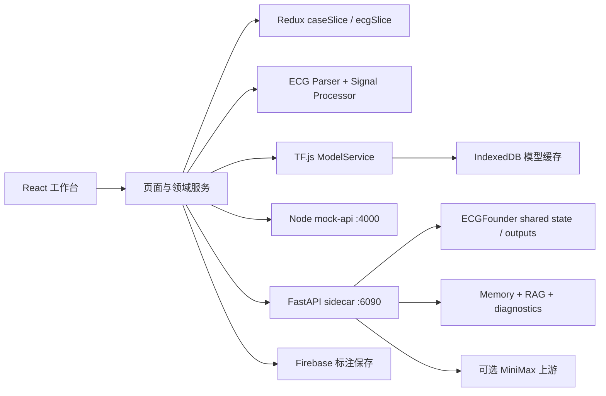
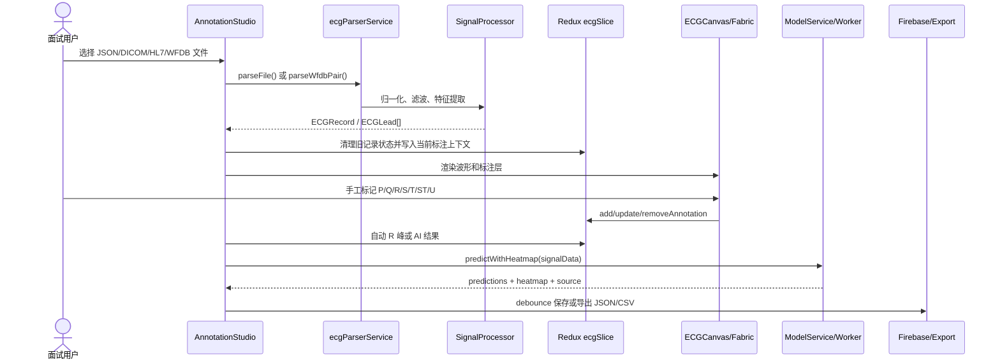
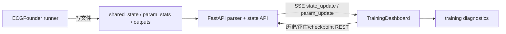
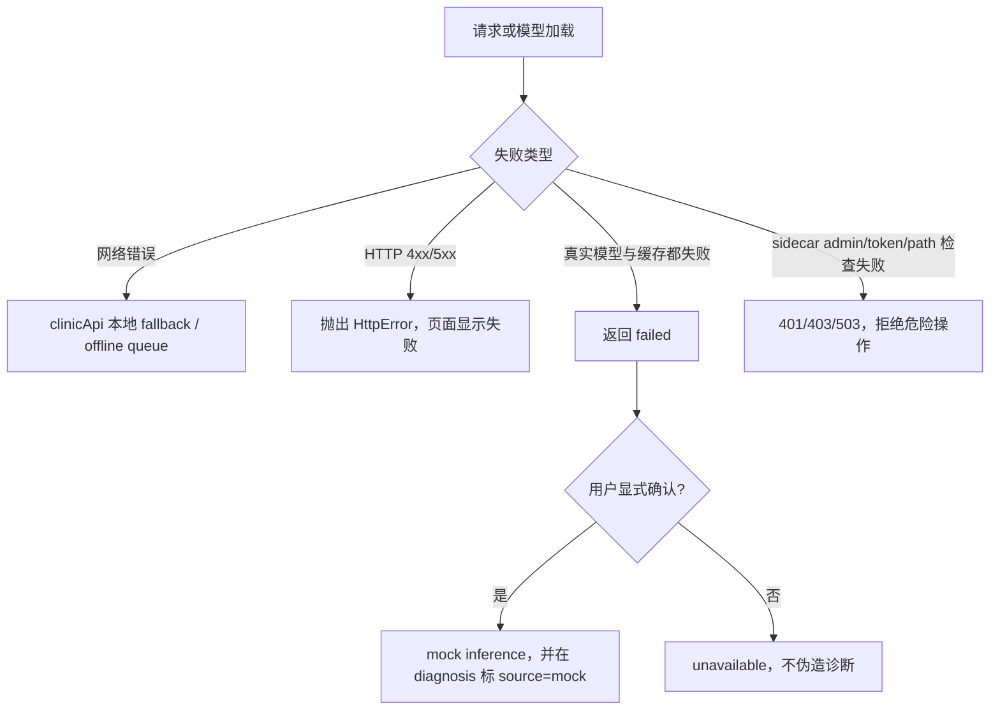

# ECG 标注与分析平台：测试开发面试架构设计

> 版本：2026-07-11
>
> 适用场景：测试开发实习生面试、项目答辩、回归测试设计讨论
>
> 事实来源：当前仓库源码、前端/后端测试目录、README、2026-07-07 审计报告，以及候选人提供的简历和岗位截图。

## 1. 面试定位

这个项目可以用一句话概括：**一个浏览器端 ECG 数据标注与 AI 辅助分析工作台，围绕“导入 - 解析 - 预处理 - 标注 - 推理 - 导出”形成可测试的闭环，并通过本地 mock API、FastAPI sidecar 和可选模型服务支撑病例与训练演示。**

面试时不要把它描述成已经上线的临床诊断系统。README 明确它是 research preview：病例数据、部分模型指标和解析器仍有 demo/mock 边界，导出结果也带有 `diagnosis.source` 用于区分 `real`、`mock` 和 `unavailable`。这个边界本身就是测试开发的亮点：测试不只验证“页面能否点击”，还要验证降级是否显式、数据是否可追溯、危险能力是否被保护。

## 2. 当前架构总览

配套的可编辑图源见 [`ecg-platform-architecture.mmd`](../../interview/ecg-platform-architecture.mmd)。图中实线表示当前代码链路，虚线表示仅用于面试讨论的企业化演进方向。

### 2.1 运行边界

| 区域 | 当前实现 | 面试应该强调的边界 |
|---|---|---|
| 浏览器 | React 18、TypeScript、Ant Design、React Router、Redux Toolkit、Fabric.js | 页面按 lazy route 加载；工作台状态和病例状态分 slice 管理 |
| 病例 API | `mock-api/server.js`，默认 `http://localhost:4000/api` | 网络错误才回退内置 PTB-XL 20 条备份；HTTP 错误不应静默吞掉 |
| ECG 处理 | `ecgParserService`、`dicomParser`、`wfdbParser`、`SignalProcessor` | 多格式归一为 `ECGRecord/ECGLead`，解析器是高风险输入边界 |
| AI 推理 | TF.js `ModelService`，可写 IndexedDB 缓存，可选 Worker，缺少真实权重时由用户显式选择 mock | 不能把 mock 结果冒充真实模型；输入 shape 和输出 activation 是模型合同 |
| 标注保存 | Firebase 延迟初始化，按记录 debounce 保存；本地仍可导出 | 配置失败要向用户可见；跨记录切换不能把旧标注写入新记录 |
| 训练/助手 | FastAPI sidecar :6090，读取 ECGFounder 文件状态，SSE 推送训练状态，助手用本地 memory + RAG | sidecar 默认面向本机 demo；部署到非本机前必须加强鉴权、路径校验、审计和数据隔离 |

## 3. 核心模块与职责

### 3.1 页面与路由层

`src/App.tsx` 使用 `React.lazy()` 和 `Suspense`，路由包含 Dashboard、Case List、Case Detail、Annotation Studio、AI Models、Training Dashboard、Settings。这个分层的价值是让页面边界清晰，也让测试可以按页面入口和领域服务分别覆盖。

### 3.2 病例管理模块

`clinicApi.ts` 通过统一的 `requestJson` 访问 `/dashboard`、`/patients`、`/patients/:id`。当发生网络错误时使用本地构造的 fallback；当服务返回 4xx/5xx 时抛出 `HttpError`，交给页面展示错误。Node mock API 使用 `database.json` 提供病例 CRUD 和 dashboard 汇总。

面试表达：**这里有明确的错误分类合同：网络不可达可以降级，服务端拒绝或数据格式错误不能伪装成成功。** 这比简单写一个 `catch { return [] }` 更容易保证问题可观测。

### 3.3 ECG 导入与信号处理

入口位于 `AnnotationStudio` 和 `ecgParserService`：

1. `.json` 走结构化 JSON 校验；
2. `.hl7` 先按文本读取，再进入 HL7 解析；
3. DICOM/WFDB 等二进制文件进入格式检测与 parser；
4. WFDB 必须先暂存同名 `.hea` 与 `.dat`，成对后再解析；
5. `SignalProcessor` 按选项执行去基线、归一化和带通处理；
6. 对代表性导联提取信号质量、心率等特征，最终构造统一 `ECGRecord`。

测试重点是“格式边界 + 数据合同 + 失败可解释”：空字段、错误 JSON、单独 `.dat`、损坏二进制、采样率异常、大小端/高字节、不同 lead 长度都应有明确用例。

### 3.4 标注工作台与状态管理

`AnnotationStudio` 负责导入、导联切换、播放窗口、快捷键、自动 R 峰检测、AI 分析、导出和持久化编排；`ECGCanvas`/`WaveformRenderer` 负责 Fabric.js 画布上的波形与标注层；`ecgSlice` 存储当前记录、标注、画布状态、模型状态和推理结果；`caseSlice` 存储患者列表、当前患者与当前记录。

状态边界的面试说法：**Redux 存跨组件、可回放的领域状态；画布实例、Worker、TF Tensor 等不可序列化对象不进入 Redux，序列化检查对推理结果路径做了明确豁免。** 导航到新记录或重新导入时，必须同时清理 annotations、inferenceResults、sourceLeadsRef 和播放游标。

### 3.5 AI 推理与降级

`ModelService.loadModel()` 按以下顺序尝试：远程/静态模型资源 -> IndexedDB 缓存；缓存写失败不会丢弃本次已加载的内存模型；两者都失败时返回 `failed`，只有用户确认后 UI 才调用 `useMockInference()`。

输入侧通过 `buildInputTensor` 根据模型 input shape 处理 2D、3D、4D 合同，并兼容 lead-major/time-major；输出侧通过 `normalizeToProbabilities` 区分 softmax 与 sigmoid，避免把多标签 sigmoid 误归一成总和 1。`predictWithHeatmap` 生成主导导联热力向量；Worker 提供可选的后台推理路径。

另一路是 Minimax：浏览器只提交 signalData 和模型名到 sidecar `/api/ecg/analyze`，API key 由 sidecar 注入并转发，浏览器不持有上游 key。

### 3.6 导出与可追溯性

`exportUtils` 支持 JSON、CSV 和底层 TCX helper；当前工作台主入口使用 JSON/CSV。导出记录包含 leads、annotations、metadata 和 diagnosis。`buildDiagnosis` 会把推理来源写为 `real`、`mock` 或 `unavailable`，这是面试中展示“结果可追溯、降级可识别”的最好例子。

### 3.7 训练与助手 sidecar

`TrainingDashboard` 通过 `trainingApi.ts` 查询历史轮次、epoch log、评估、参数统计和 checkpoint；实时状态与参数统计分别用 SSE 连接 `/api/training/state/stream` 和 `/api/training/param-stats/stream`。FastAPI sidecar 读取 `shared_state`、`param_stats`、`train_task` 以及 ECGFounder `outputs`，并通过 parser 将不同训练日志格式归一为前端合同。

助手模块由 `AssistantService` 组合 `MemoryStore` 与 `RAGStore`：可以记录当前病例快照，按关键词/上下文选择病例回答、memory 检索或知识库检索，也能输出训练诊断。它是本地演示型辅助能力，不等价于医疗诊断。

## 4. 核心数据流

### 4.1 ECG 标注主链路

### 4.2 训练监控链路

### 4.3 错误与降级流

## 5. 面向测试开发岗位的测试策略

### 5.1 测试分层

| 层级 | 当前资产 | 目标与例子 |
|---|---|---|
| 纯函数单元 | parser、signalProcessor、modelService helper、buildDiagnosis、exportUtils | 快速锁定格式、数值、概率归一化、导出合同 |
| 服务合同 | `clinicApi`、`httpClient`、`trainingApi`、`ecgAssistantApi`、`minimaxService` | 验证 URL、method、body、超时、错误分类、SSE 事件解析 |
| 状态与组件集成 | `AnnotationStudio.test.tsx`、workflow/smoke 测试、Redux slice 测试 | 验证导入后清状态、标注增删改、AI 结果回写、导出入口 |
| Sidecar 后端 | 9 个 pytest 文件覆盖 assistant、state lock、training contract、parser、Minimax | 验证路径 containment、admin token、输出解析、上游错误映射 |
| 浏览器 E2E | 当前仓库没有独立 Playwright 套件 | 面试中应说明下一步会补最小关键路径，而不是声称已有完整 E2E |

当前仓库约有 30 个前端测试文件和 9 个后端 pytest 文件，重点覆盖 parser、模型输入/输出边界、离线队列、API 合同、训练解析、助手和工作流。

### 5.2 关键测试用例矩阵

| 风险 | 正向用例 | 异常/边界用例 | 回归断言 |
|---|---|---|---|
| 导入 | JSON、HL7、DICOM、成对 WFDB 正常生成 `ECGRecord` | 错误 JSON、单独 `.dat`、损坏文件、空 leads、异常采样率 | 错误可解释，旧记录状态不泄漏 |
| 标注 | 手工 PQRST、自动 R 峰、快捷键、播放窗口 | 阈值过高、空导联、切换记录、删除后重绘 | annotations 与 canvas 坐标保持一致 |
| AI | 真实模型加载、缓存命中、Worker 推理、heatmap | 网络失败、缓存写失败、shape 不匹配、用户拒绝 mock | `source` 正确，sigmoid 不被 softmax 化 |
| 持久化 | debounce 保存、导出 JSON/CSV | Firebase 配置缺失、写入失败、URL 切换竞态 | 不把旧记录写入新记录；失败有提示 |
| 训练 | 历史、评估、checkpoint、SSE 更新 | 404、坏 JSON、断流、空输出、重复训练 | 前后端字段合同一致，关闭 EventSource |
| 安全 | 合法来源与合法 checkpoint 下载 | 无 token、错 token、路径穿越、恶意文件名、缺少 Minimax key | fail-closed，key 不到浏览器 |

### 5.3 回归测试闭环

1. 通过需求/审计记录识别风险，例如“模型加载失败是否会静默变 mock”“记录切换是否串标注”。
2. 将风险拆成最小可观察行为、输入、预期输出和日志/提示。
3. 先补纯函数或合同测试，再补页面集成测试；避免只测按钮是否可点击。
4. 每次修复运行最小相关测试，合并前运行 `npm run check` 与 `npm run test:backend`。
5. 把线上/演示 badcase 反写为固定回归集，保存版本、来源、预期风险等级和复现步骤。

## 6. 当前实现、已知边界与演进建议

### 当前实现（可直接面试陈述）

- 前端工作台、病例浏览、导入解析、Canvas 标注、AI 辅助、导出和训练监控链路已具备演示闭环。
- AI 缺少真实权重时不会静默伪装成真实推理，mock 结果有显式标记。
- sidecar 有本地 CORS allow-list、admin token 依赖、路径 containment 与 checkpoint 文件名白名单等保护。
- 训练状态采用文件状态 + SSE，适合本机 runner/observer 演示。

### 明确边界（必须主动说）

- mock API 和 PTB-XL 20 条备份不是生产病例数据库；Firebase 云保存依赖环境配置。
- DICOM/HL7/WFDB 是轻量示例解析器，不能直接等同于完整临床互操作实现。
- 真实部署仍需要多用户身份、细粒度授权、审计、数据库事务、数据脱敏和更强的 CORS/CSRF 策略。
- 当前没有完整浏览器 E2E 与真实模型准确率验收；应分别补关键路径 E2E 与固定 golden set。

### 面试中可提出的演进

1. 用后端统一 ECG ingestion service 和版本化 schema 替代浏览器端大文件解析，保留同一 `ECGRecord` 合同。
2. 将训练状态从共享文件迁移到任务队列 + DB/时序存储，SSE 改为带断线重连和 last-event-id 的事件流。
3. 为模型注册输入 shape、采样率、label schema、activation、版本和校验和；推理前做合同校验。
4. 增加 Playwright 关键路径：病例进入标注页、上传一对 WFDB、手工标注、mock AI、导出并验证文件内容。
5. 引入身份/权限/审计服务，sidecar 只暴露最小 API；checkpoint 下载使用签名 URL 或服务端授权。

## 7. 面试速记附录

### 7.1 60 秒项目介绍

“我做的是一个基于 React + TypeScript 的 ECG 标注和 AI 辅助分析工作台。用户可以从 JSON、HL7、DICOM 或 WFDB 导入信号，经过统一 parser 和信号预处理后，在 Fabric.js 画布上做 PQRST 标注，也可以运行 TensorFlow.js 推理或通过本地 sidecar 调用 Minimax，最后导出带标注和诊断来源的 JSON/CSV。项目还包含病例 mock API、训练状态 SSE 和本地 memory/RAG 助手。我的测试重点不是只测页面，而是围绕解析器边界、模型降级、记录切换竞态、API 合同和 sidecar 安全做单元、集成和后端回归测试。”

### 7.2 3 分钟展开顺序

1. 先画四段：浏览器工作台、领域服务、mock API/sidecar、Firebase/模型上游。
2. 走一条主链路：导入 -> 归一化 -> 画布标注 -> 推理 -> diagnosis source -> 导出。
3. 讲一个测试难点：真实模型缺失时的三态结果，必须区分 loaded/mock/failed，且 mock 只能显式确认。
4. 讲一个数据一致性难点：记录切换时要清空旧标注、推理结果、source leads，并防止 debounce 保存串记录。
5. 讲一个安全难点：Minimax key 留在 sidecar；训练删除/停止和 checkpoint 路径必须 fail-closed。
6. 收尾说明边界：当前是 research preview，下一步会补真实模型 golden set、Playwright 关键路径、身份和审计。

### 7.3 高频追问与回答骨架

**问：为什么用 Redux？**

答：病例与 ECG 工作区状态会被列表、详情、画布、分析面板共同消费，Redux 提供可预测的更新边界和 selector。画布实例、Worker、Tensor 不放进 Redux，避免不可序列化和生命周期混乱。

**问：如何测试 AI，模型本身不稳定怎么办？**

答：把模型黑盒准确率和软件合同分开。固定 golden set 验证模型版本；代码测试验证输入 shape、采样率/lead 对齐、softmax/sigmoid 归一化、超时、缓存失败、mock 显示和 diagnosis source。这样模型变化不会让所有软件回归测试失去确定性。

**问：为什么需要 mock inference？**

答：它服务于 UI 演示和无权重开发，不代表真实诊断。真实模型和 IndexedDB 都失败时先返回 failed，用户确认后才进入 mock，并在 UI 和导出结果中保留来源标记。

**问：网络错误和 HTTP 500 都回退吗？**

答：不应该。网络不可达属于可预期离线场景，可以使用本地 fallback；服务器明确返回 4xx/5xx 代表请求或服务有问题，应抛出错误并让用户知道，避免把故障伪装成空数据。

**问：怎么防止记录切换时数据串线？**

答：URL 变化时清理 per-record 状态；保存 debounce 捕获 recordId，并在回调触发时和 ref 中的当前 recordId 比较，不一致就丢弃旧写入。对应测试要在 1 秒窗口内模拟 A -> B 切换。

**问：sidecar 为什么用 SSE？**

答：训练状态是服务端持续产生的单向事件，SSE 比客户端高频轮询更省资源，也比 WebSocket 更简单。前端要处理 JSON 解析失败、断流、关闭 EventSource 和重连策略；当前实现已封装关闭函数，企业化版本应补 last-event-id。

**问：这个项目最需要改进什么？**

答：先补部署硬门槛：身份/权限、审计、数据持久化、严格路径与 CORS；再补真实模型版本合同和 golden set；最后用 Playwright 覆盖导入到导出的关键路径。这样能把 demo 闭环升级成可验收的测试对象。

### 7.4 可主动展示的测试案例

- “单独上传 `.dat` 应提示必须同时选择同名 `.hea`，而不是生成一条坏波形。”
- “缓存写失败时，本次真实模型仍可推理；下一次冷启动才需要重新加载。”
- “用户拒绝 mock 后，导出 diagnosis source 必须是 unavailable。”
- “Sidecar 缺少 `SIDECAR_ADMIN_TOKEN` 时，训练停止/删除不能执行。”
- “恶意 checkpoint 文件名或 round 路径应被 400 拒绝，不能访问 outputs 外部路径。”

## 8. 事实口径纠偏

简历可继续突出 React + Vite 的通用前端经验，但介绍本仓库时应以当前代码为准：构建配置是 Webpack，页面使用 React.lazy；项目包含 TensorFlow.js、Fabric.js、Node mock API 与 Python FastAPI sidecar。可以说“我熟悉 Vite/React 生态”，不要说“本仓库生产构建由 Vite 驱动”。同理，简历中的离线推理与 ECGFounder 模型链路应表述为“支持真实模型接入、缓存和显式 mock 降级”，不要把当前缺失的模型权重说成已经完成临床准确率验收。

## 9. 复习清单

- [ ] 能在 60 秒内讲完导入到导出的主链路
- [ ] 能解释 `ECGRecord`、`ECGLead`、`Annotation` 和 `ModelPrediction` 的关系
- [ ] 能举出一个网络错误降级用例和一个 HTTP 500 不降级用例
- [ ] 能说明 softmax 与 sigmoid 的测试差异
- [ ] 能说明记录切换与 debounce 保存的竞态测试
- [ ] 能解释 SSE、sidecar、admin token 和路径 containment
- [ ] 能诚实说明 mock 数据、轻量 parser、无完整 E2E 的项目边界

