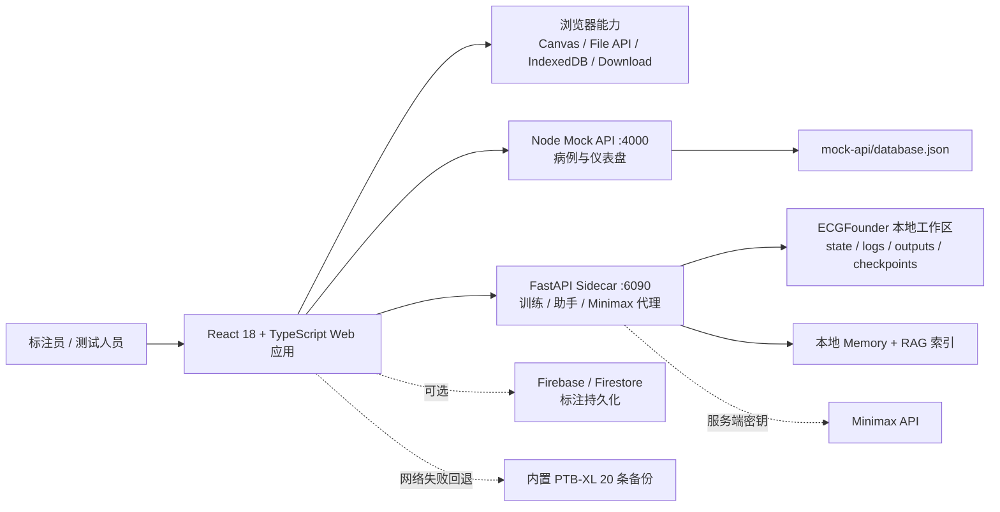
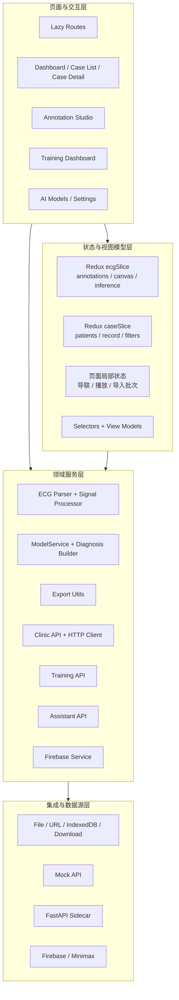
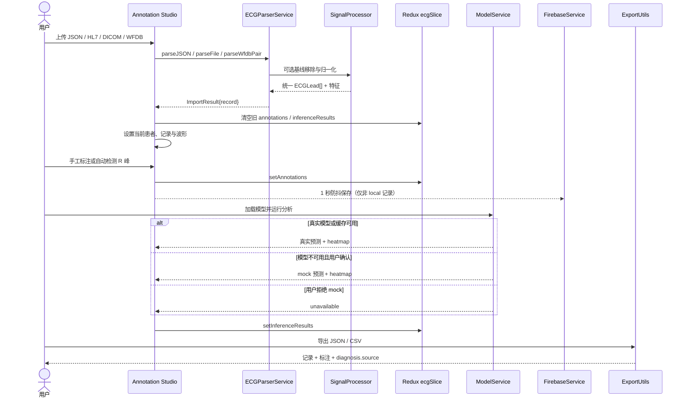
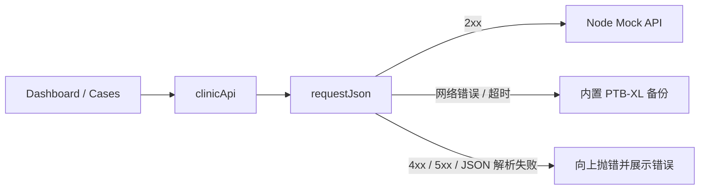
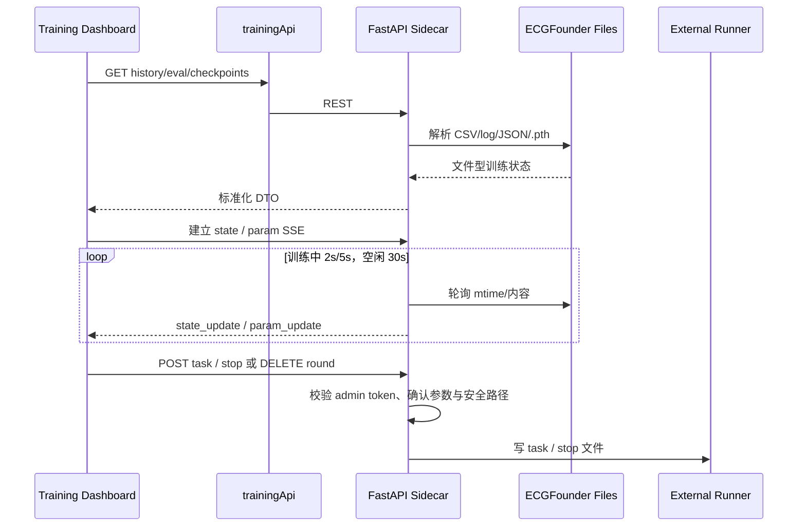
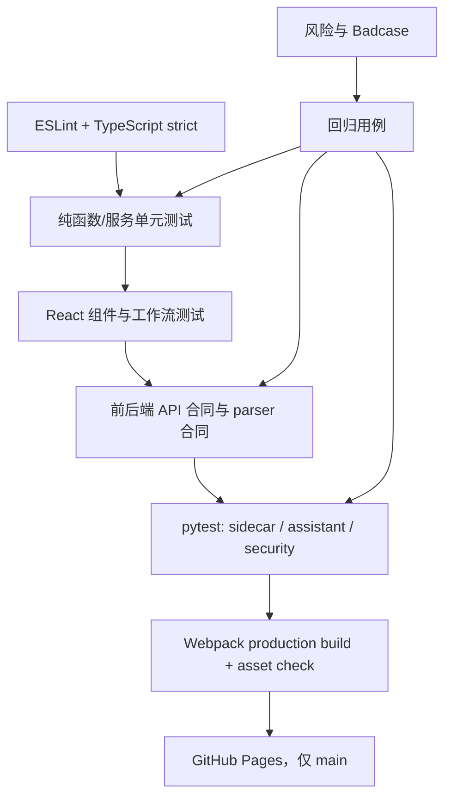
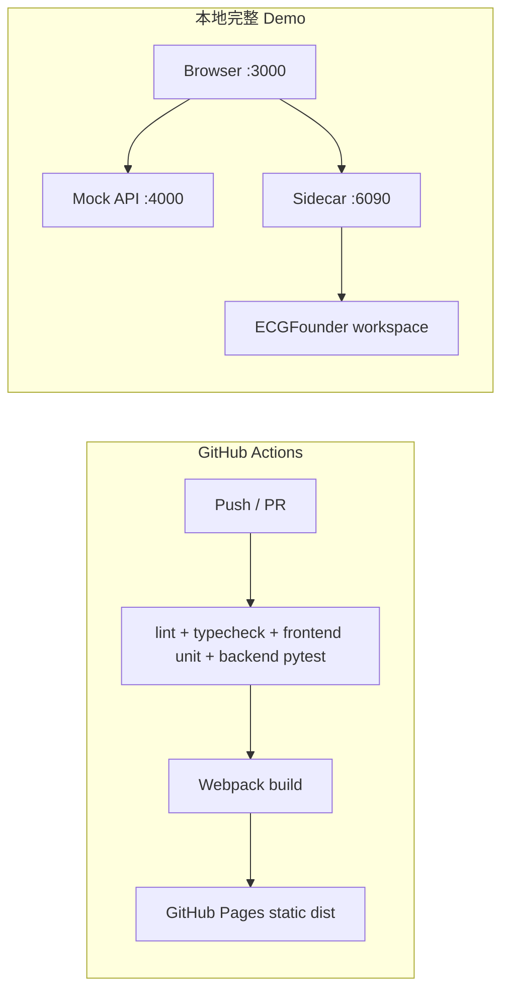

# ECG 标注平台：面向测试开发面试的系统架构设计

> 状态：基于 2026-07-11 当前仓库代码整理。本文只把已实现能力描述为现状；规划能力单列。

## 1. 文档目标

本文服务于测试开发实习岗位面试，回答五个问题：

1. 系统由哪些部分组成，各自承担什么职责？
2. ECG 数据如何从导入流向标注、推理和导出？
3. 本地 mock、真实模型缺失、网络失败时系统如何降级？
4. 哪些接口和状态边界最容易出错，应如何设计自动化回归？
5. 候选人如何在 1-3 分钟内讲清自己的工程贡献与质量意识？

非目标：不把该项目包装成临床医疗器械，不展开 ECGFounder 算法训练原理，不把早期 `SPEC.md` 中尚未落地的能力描述为现状。

## 2. 一句话定位

这是一个面向演示和工作流验证的 ECG 标注与训练观察平台：React 前端承载病例浏览、信号导入、Canvas 标注、AI 辅助与训练看板；本地 Node mock API 提供病例数据；FastAPI sidecar 对接 ECGFounder 的文件型训练状态、历史输出、checkpoint、轻量助手与 Minimax 代理。

核心质量边界是：真实数据与 mock 数据可区分，真实模型与模拟推理可区分，网络失败与业务失败不混淆，跨记录状态不串写，破坏性训练操作受约束。

## 3. 系统上下文与分层架构

### 3.1 架构特点

- 路由按页面 `React.lazy()` 加载，控制首屏体积。
- Redux 只保存跨组件共享状态；波形、播放和上传批次等高频/页面级状态留在 Annotation Studio。
- `ecg.inferenceResults` 被显式排除 Redux 序列化检查，避免模型结果中的复杂数据触发误报。
- API 地址统一由 `src/config/env.ts` 提供，开发态默认指向 4000 与 6090 端口。
- 病例、训练、助手拆成独立服务接口，便于 mock、合同测试和故障隔离。

## 4. 核心模块

| 模块 | 主要职责 | 关键输入/输出 | 主要风险与测试点 |
|---|---|---|---|
| 路由与布局 | 页面导航、懒加载、错误边界、非临床提示 | URL -> 页面组件 | 未知路由、chunk 加载失败、免责声明缺失 |
| 病例管理 | 仪表盘、患者列表、病例详情和新建患者 | REST JSON <-> `Patient` / `ECGRecord` | 4xx/5xx 与网络错误区分、fallback 数据来源 |
| ECG 导入解析 | JSON、HL7、DICOM、WFDB 成对文件转统一记录 | File/文本 -> `ECGRecord` | 格式识别、字节序、坏文件、`.hea/.dat` 配对 |
| 信号处理 | 基线移除、归一化、滤波、质量与特征计算、R 峰检测 | `ECGLead[]` -> 处理后导联/指标 | 空数组、阈值边界、采样率、NaN/极值 |
| Canvas 标注 | 波形渲染、P/Q/R/S/T/ST/U 标注、选择与删除 | 导联 + Annotation[] | 坐标映射、缩放、跨记录残留、快捷键冲突 |
| AI 推理 | 真实 TF.js 模型加载、IndexedDB 缓存、显式 mock、概率归一化 | 多导联数组 -> `ModelPrediction[]` | 模型缺失、shape 合同、softmax/sigmoid、tensor 释放 |
| 诊断与导出 | 给推理结果附来源并导出 JSON/CSV | 当前记录 -> 下载文件 | mock 来源丢失、字段转义、时间/数值格式 |
| 训练看板 | REST 获取历史，SSE 观察状态与参数，提交/停止/删除任务 | Sidecar API <-> 训练视图模型 | SSE 重连、事件解析、鉴权、路径编码、并发任务 |
| 本地助手 | 病例快照、memory、repo RAG、规则型训练诊断 | 问题 + 上下文 -> 答案/来源 | 无上下文、索引失败、路径泄露、医疗越界 |
| CI/CD | lint、类型检查、前后端测试、构建、Pages 部署 | push/PR -> 门禁与静态站点 | 依赖漂移、静态站点无本地 sidecar、产物缺失 |

## 5. 核心数据流

### 5.1 导入、标注、推理、导出主链路

关键不变量：

- 新记录或新导入必须同时清除旧波形、标注和推理结果。
- Firebase 防抖保存执行前再次核对活动 `recordId`，避免把 A 记录标注写到 B 记录。
- 真实模型加载失败不能静默进入 mock；只有用户确认后才设置 `outcome='mock'`。
- 导出结果通过 `diagnosis.source = real | mock | unavailable` 保留推理来源。

### 5.2 病例数据与 fallback 流

这一设计避免把服务端 bug 伪装成“正常 fallback”。测试需要分别模拟 `TypeError/AbortError`、404、500 和非法 JSON。

### 5.3 训练观察与控制流

注意：当前前端训练控制请求没有附带 admin token，而 sidecar 已对破坏性路由 fail-closed。这是一个明确的集成合同风险，应作为面试中的真实缺陷示例，而不是回避。

### 5.4 助手与 Minimax 数据流

- 本地助手：前端发送病例快照或问题；sidecar 从本地 memory 与仓库 RAG 索引检索，规则服务生成带来源的参考答案。
- 训练诊断：sidecar 读取当前训练状态、参数和历史记录，生成 warning、recommendation 和 metric。
- Minimax：浏览器只发送信号与模型名到 sidecar；sidecar 从环境变量读取密钥并请求上游，浏览器不持有密钥。
- 所有助手内容都必须保留“非临床诊断”边界。

## 6. 状态与数据合同

### 6.1 核心实体

- `ECGRecord`：记录 ID、患者 ID、设备、时间、导联、采样率、时长、标注、信号质量和可选诊断。
- `ECGLead`：导联名、采样数组和采样率。
- `Annotation`：类型、位置/区间、导联、置信度与人工/自动来源信息。
- `ModelPrediction`：类别名、概率和可选 heatmap。
- `TrainingState`：状态、轮次、epoch、指标、时间和错误。

### 6.2 状态边界

| 状态 | 所在位置 | 生命周期 |
|---|---|---|
| 标注、画布、推理结果 | Redux `ecgSlice` | 页面间共享，清记录时重置 |
| 患者、当前病例、筛选分页 | Redux `caseSlice` | 病例工作流共享 |
| 原始导联、播放窗口、上传配对 | Annotation Studio 本地 state/ref | 当前页面/记录 |
| TF.js 模型 | `ModelService` 单例 + IndexedDB cache | 当前会话 / 浏览器持久缓存 |
| 病例 mock 数据 | `mock-api/database.json` | 本地服务持久化 |
| 标注云存储 | Firestore（可选） | 远端持久化 |
| 训练状态与输出 | ECGFounder 工作区文件 | 由外部 runner 管理 |
| 助手记忆与索引 | sidecar `.data` / repo RAG | 本地持久化 |

## 7. 错误处理与降级策略

| 场景 | 当前策略 | 测试断言 |
|---|---|---|
| Clinic API 网络失败 | 回退内置 PTB-XL 数据 | 来源标签正确，页面可用 |
| Clinic API 4xx/5xx | 不 fallback，向 UI 抛错 | 错误可见，不展示伪成功数据 |
| Firebase 初始化失败 | 持久错误条 + toast，提示手动导出 | 关闭提示后保存仍不抛未处理异常 |
| Firebase 保存失败 | toast 5 秒节流 | 首次立即提示，重复失败不刷屏 |
| 真实模型缺失 | 弹窗要求用户确认 mock | 拒绝时保持 unavailable |
| TF.js cache 写失败 | 保留已加载内存模型并警告 | 当前会话仍可推理 |
| WFDB 单独 `.dat` | 返回需要同名 `.hea` 的明确错误 | 不进入 DICOM/unknown 模糊错误 |
| SSE 事件非法 JSON | 丢弃并触发 parse_error | 页面不中断，可建立重连策略 |
| Minimax 未配置 key | sidecar 503 + 可操作提示 | key 不进入浏览器请求 |
| 破坏性训练操作无 token | sidecar 503/401 fail-closed | 不产生 task/stop/delete 副作用 |

## 8. 安全与非临床边界

- CORS 默认仅允许本地开发源；远程部署必须显式配置 allow-list。
- checkpoint 文件名限制为安全的 `.pth` 单段文件名，并对解析后路径做目录 containment 检查。
- 删除训练轮次要求 `?confirm=<round_name>`，并校验路径不能逃逸 outputs 根目录。
- 训练提交、停止和删除要求 bearer admin token；未配置时服务 fail-closed。
- Minimax 密钥只存 sidecar 环境变量，浏览器不发送用户密钥到任意 endpoint。
- UI、导出和助手均需持续标记 demo/mock/non-clinical；这是医疗 AI 测试的重要验收项。

## 9. 测试架构

当前仓库约有 30 个前端测试文件和 9 个后端 pytest 文件。测试重点包括：

- parser：格式识别、DICOM、HL7、WFDB、坏输入与边界字节。
- 模型：输入 shape、真实/mock 状态、概率归一化、缓存失败、多导联选择。
- 标注：Redux 单一事实源、自动 R 峰、快捷键、跨记录清理、导出一致性。
- API：网络 fallback、HTTP 错误、SSE 事件、训练 DTO、Minimax 代理。
- sidecar：训练 API 合同、状态锁、输出 parser、路径遍历、鉴权、上游错误清洗。
- 助手：memory、RAG、病例分析和训练诊断。
- 构建：资源完整性、dist 清理、demo preflight、Pages 部署门禁。

### 9.1 面试可讲的风险驱动回归闭环

1. 从审计、用户反馈或 Badcase 中发现风险，例如跨记录状态串写。
2. 建立最小复现，明确输入、前置状态、实际结果和期望结果。
3. 在最低稳定层补回归：纯函数优先单测，跨层合同补 API/组件测试。
4. 修复实现，并验证相邻边界，例如防抖回调中的 stale closure。
5. 跑相关最小测试，再跑 `npm run check` 与 `npm run test:backend`。
6. CI 阻止失败版本进入 Pages 部署。

### 9.2 优先级测试矩阵

| 优先级 | 场景 | 测试类型 | 代表性断言 |
|---|---|---|---|
| P0 | 记录切换/导入后旧标注与 AI 结果残留 | 组件工作流 | B 记录不含 A 的 state |
| P0 | 导出把 mock 结果误标为 real | 单元 + 工作流 | `diagnosis.source` 精确 |
| P0 | checkpoint/round 路径遍历 | 后端安全测试 | 400 且不读取根目录外文件 |
| P0 | 无鉴权触发训练/删除 | API 合同 | 401/503 且无副作用 |
| P1 | 模型缺失静默 mock | 组件 + 服务 | 必须显式确认 |
| P1 | Firebase 防抖跨记录写错 | fake timer 组件测试 | captured ID 与 active ID 一致才写 |
| P1 | `.hea/.dat` 配对与高字节解析 | parser fixture | 波形值与样本长度正确 |
| P1 | SSE 非法事件/断线 | 服务测试 | 不崩溃、报告 parse_error/重连 |
| P2 | GitHub Pages 无本地 API | 预检/E2E | fallback 可用且模式标签正确 |

## 10. 部署视图与已知约束

- GitHub Pages 只部署静态前端；4000/6090 本地服务不会随 Pages 发布。
- 因此线上静态演示依赖内置病例 fallback，训练、助手和服务端 Minimax 功能需要本地 sidecar。
- DICOM/HL7/WFDB parser 属于 demo 级轻量实现，不等同完整临床标准实现。
- 默认真实 TF.js 模型资源当前缺失；AI Models 页中的指标为 mock 展示。

## 11. 简历与面试口径纠偏

| 简历常见表述 | 当前代码事实 | 推荐面试说法 |
|---|---|---|
| React + Vite | 当前构建脚本与配置是 Webpack 5 | “前端使用 React/TS，当前仓库由 Webpack 构建并做路由拆包。” |
| Dexie 缓存模型 | 依赖与主链路都用到 Dexie；`modelService.loadModel` 成功后通过 `modelCacheRepository.recordLoad` 写元数据(`url` / `sizeBytes` / `lastLoadedAt` / `source`)。model binary 仍由 TF.js `indexeddb://` 落盘，两者用不同 IndexedDB dbName(本仓库 `ecg-model-cache` vs TF.js 默认 `tensorflowjs`)互不干扰 | “Dexie 接主链路索引模型缓存元数据(URL / 加载时间 / 来源 / 大小)，UI 面板可见可清；TF.js `indexeddb://` 仍存 model binary。两层职责分离。v2 schema 会把 binary 也搬进 Dexie，届时本层做一次迁移。” |
| Web Worker 加载并运行模型 | Worker 与 hook 能力存在；Annotation Studio 默认调用 `ModelService.predictWithHeatmap` 主线程路径 | “实现过 Worker 推理通道，当前工作台主链路仍走 ModelService；这也是下一步性能/E2E 测试点。” |
| 加载 ECGFounder 模型 | 默认 `/models/ecg-classifier/model.json` 当前未提供，需真实模型或显式 mock | “完成模型加载、缓存、shape 与 fallback 合同；demo 环境未内置真实权重，明确区分 mock。” |
| 端到端部署 | Pages 部署静态前端，本地 API/sidecar 不随站点部署 | “完成静态前端 CI/CD；完整训练与助手演示需本地 sidecar。” |

口径原则：承认 demo 边界不会减分；能清楚解释为何要区分 mock/real、为何对 fallback 和安全合同做回归，反而更贴合测试开发岗位。

## 12. 面试叙事模板

### 12.1 1 分钟版本

“我参与的是一个 ECG 标注与训练演示平台。前端用 React、TypeScript 和 Redux，支持病例浏览、JSON/HL7/DICOM/WFDB 导入、Canvas PQRST 标注、TF.js 辅助推理和 JSON/CSV 导出；本地 FastAPI sidecar 对接 ECGFounder 训练状态，通过 REST 和 SSE 展示历史、指标与 checkpoint。我的重点不仅是实现功能，而是把 mock 与真实模型、网络失败与业务失败、跨记录状态和破坏性接口这些边界做清楚，并用前端单测、pytest 合同测试和 CI 门禁形成回归闭环。”

### 12.2 3 分钟展开顺序

1. 业务目标：降低 ECG 标注与模型迭代的演示/验证成本。
2. 核心链路：导入 -> 统一数据结构 -> 标注 -> 推理 -> 来源明确的导出。
3. 架构边界：浏览器工作台、病例 mock API、训练 sidecar、外部 ECGFounder。
4. 测试难点：多格式 parser、跨记录状态、模型 shape/fallback、SSE 与文件型状态、安全路径。
5. 质量闭环：Badcase/审计 -> 回归用例 -> 修复 -> 全量检查 -> CI -> Pages。
6. 反思与演进：补 Playwright 主链路、统一 admin token 注入、Worker 默认化、真实模型契约和临床级 parser。

## 13. 高频追问与回答要点

### 为什么病例 API 只在网络错误时 fallback？

404/500 表示接口或业务存在问题，若也回退 mock，会把真实故障伪装成成功；只有连接失败、超时等可用性问题才进入演示 fallback。

### 如何测试 AI 功能？

分四层：输入数据质量与 shape；模型加载/缓存/降级合同；输出概率、类别和来源字段；端到端业务行为与非临床提示。真实模型指标测试与 UI mock 测试不能混为一谈。

### 为什么 Redux 不保存所有内容？

共享的标注、画布和推理结果放 Redux；高频波形播放、File 对象和配对上传状态留在组件/ref，减少序列化和渲染成本，并避免把不可序列化对象扩散到全局状态。

### SSE 怎么测试？

服务层测试事件名称、合法/非法 JSON 和 close；组件层测试状态更新、错误提示和卸载关闭连接；E2E 测试断线重连、重复事件和训练从 running 到 done 的状态转换。

### 你发现过什么典型 Bug？

可讲“记录 A 切换到 B 时，防抖保存闭包可能仍持有 A 的标注并写向错误记录”。修复使用活动 record ref 与 captured ID 二次校验，并补 fake timer 回归。这能体现 React 状态、异步时序与数据一致性能力。

### 下一步优先补什么？

先修前端 admin token 合同并补 destructive API E2E；再用 Playwright 覆盖病例进入标注、WFDB 配对、模型缺失确认、mock 来源导出和 SSE 状态；随后将 Worker 推理设为可观测的默认通道并加入性能基线。

## 14. 演进建议（非当前实现）

1. 建立 Playwright 核心 E2E 与固定 fixture，覆盖 JD 要求的自动化回归。
2. 为 trainingApi 设计安全的 admin token 注入或 BFF 会话，不把长期密钥固化在前端包。
3. 把模型元数据（输入 layout、采样率、激活函数、类别）作为版本化合同，替代 shape 启发式。
4. 为 SSE 增加指数退避、last-event-id 和连接状态可观测性。
5. 对 parser 引入真实标准 fixture、模糊测试和大文件性能基线。
6. 将 mock API、sidecar 与静态前端组成可复现的本地演示环境，并在 preflight 中校验版本与端口。

## 15. 验收标准

- 所有架构描述能映射到当前代码文件或明确标为演进建议。
- 至少包含系统架构图、标注主链路时序、训练流、测试架构和部署视图。
- 每个核心模块都有主要风险与测试点。
- 明确说明 mock/real、静态 Pages/本地 sidecar、轻量 parser/临床标准的边界。
- 附录提供 1 分钟、3 分钟叙事、高频问答和简历口径纠偏。
- 最终 DOCX/PDF 友好版经过逐页渲染检查，无图表截断、乱码或溢出。
